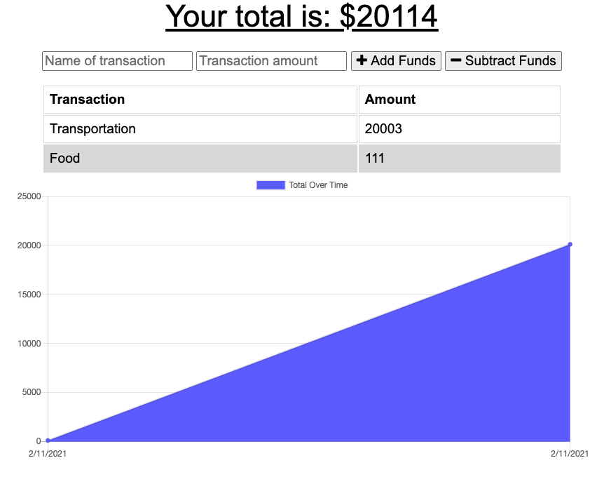

# budgetTracker

This is a Progressive Web App for a Budget Tracker created using express, Mongoose and compression.
The goal for this app is for the user to be able to enter deposits and see expenses while offline. And once the user is back online, they are able to see the expenses and deposits made while offline. 

The image below shows the working app: 

GitHub Repo Link: https://github.com/Claudialhc/budgetTracker

Heroku Deployed Link: https://blooming-wave-38760.herokuapp.com/